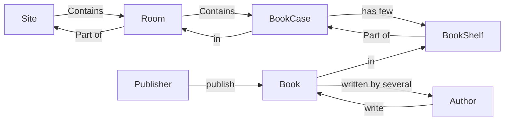

# BookShelf

Personal Book Manager.

## Object Relation



## Barcode structure

```
0N n+ d
```

- `0N`: Code type
- `n+`: Database Id Number
- `d `: sum % 10 of `n+`

Code types:
- `00`: Book Collection Id
- `01`: Book Shelf Id
- `02`: Book Case Id
- `03`: Room Id
- `04`: User Id

## Setup

### Manual

1. Copy all php files in root directory.
2. Copy all directories except `lib` and `dbinit`.
3. Rename `_config.php.example` to `_config.php`.
4. Edit `_config.php`.
5. Download `db.class.php` from [MeekroDB GitHub](https://github.com/SergeyTsalkov/meekrodb) and place under `lib/meekrodb/`.
6. Execute all sql script in `dbinit`.