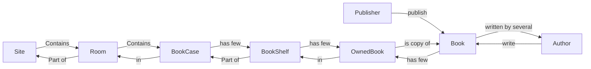

# BookShelf

Personal Book Manager.

## Object Relation


```mermaid
graph LR
    Site -- Contains --> Room
    Room -- Part of --> Site
    Room -- Contains --> BookCase
    BookCase -- in --> Room
    BookCase -- has few --> BookShelf
    BookShelf -- Part of --> BookCase

    Author -- write --> Book
    Book -- written by several --> Author

    Publisher -- publish --> Book

    Book -- has few --> OwnedBook
    OwnedBook -- is copy of --> Book

    OwnedBook -- in --> BookShelf
    BookShelf -- has few --> OwnedBook
```

## Private mode

`Site`, `Room`, `BookCase`, `Shelf`, `Book` and `OwnedBook` have a `private`
flag, toggled on their edit form. When it is set, the object is hidden from
anonymous visitors (404 on its page, filtered out of every list) and the whole
location subtree below it is hidden too. `OwnedBook` is additionally hidden when
its `Book` or its `Shelf` is private. Authenticated users always see everything.

Lists report both totals below the table (`N book(s) found.` plus
`N private book(s) hidden.`) and end with a single placeholder row stating that
private items are being hidden. The hidden total and the placeholder only appear
for anonymous visitors, since nothing is hidden from a logged-in user.

## Barcode structure

```
0N n+ d
```

- `0N`: Code type
- `n+`: Database Id Number
- `d `: sum % 10 of `n+`

Code types:
- `00`: Book Collection Id (Owned Book Id)
- `01`: Book Shelf Id
- `02`: Book Case Id
- `03`: Room Id
- `04`: User Id

## Setup

### Manual

1. Create a database and configure `.env` file
1. Run `APP_ENV=prod composer install --no-dev --optimize-autoloader`
1. Run `php bin/console doctrine:migrations:migrate`
1. (If you need) Run `php bin/console app:import-bookshelf-v1 export.json` to import data from BookShelf v1
1. Run `php bin/console app:create-admin-user` to create an admin user

## Start server for development

1. Run `.\db.debug.ps1` to start MariaDB server on Docker
2. Run `symfony serve`

## Testing

### Test database

Tests run against `app_test` (Doctrine appends the `_test` suffix to the `app`
dbname in the `test` environment). Create it before the first run:

```bash
php bin/console doctrine:database:create --env=test
php bin/console doctrine:migrations:migrate --env=test
```

### E2E suite

The E2E tests live in `tests/E2E/` and extend `AbstractPantherTestCase`. They
drive the full HTTP stack (CSRF-protected forms, sessions, real `app_test`
database) via Panther's HttpBrowser client — matching the app's no-JS design
(AGENTS.md). Each test reseeds the database, so tests are isolated and
re-runnable.

Run the whole suite:

```bash
php bin/phpunit
```

Run one test file:

```bash
php bin/phpunit --filter SomeTest
```

Notes:

- Every feature must ship with a passing E2E test covering the happy path and
  key no-JS interactions.
- The real-browser (Firefox, `PANTHER_E2E_DRIVER=firefox`) mode is wired but is
  not usable on this machine (macOS sandbox blocks geckodriver); the HttpBrowser
  client is the default.
