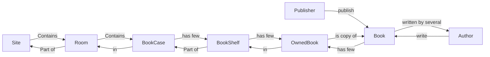

# BookShelf

Personal Book Manager.

## Object Relation


```mermaid
graph LR
    Site -- Contains --> Room
    Room -- Part of --> Site
    Room -- Contains --> BookCase
    BookCase -- in --> Room
    BookCase -- has few --> BookShelf
    BookShelf -- Part of --> BookCase

    Author -- write --> Book
    Book -- written by several --> Author

    Publisher -- publish --> Book

    Book -- has few --> OwnedBook
    OwnedBook -- is copy of --> Book

    OwnedBook -- in --> BookShelf
    BookShelf -- has few --> OwnedBook
```

## Barcode structure

```
0N n+ d
```

- `0N`: Code type
- `n+`: Database Id Number
- `d `: sum % 10 of `n+`

Code types:
- `00`: Book Collection Id (Owned Book Id)
- `01`: Book Shelf Id
- `02`: Book Case Id
- `03`: Room Id
- `04`: User Id

## Setup

### Manual

1. Create a database and configure `.env` file
1. Run `APP_ENV=prod composer install --no-dev --optimize-autoloader`
1. Run `php bin/console doctrine:migrations:migrate`
1. (If you need) Run `php bin/console app:import-bookshelf-v1 export.json` to import data from BookShelf v1
1. Run `php bin/console app:create-admin-user` to create an admin user

## Start server for development

1. Run `.\db.debug.ps1` to start MariaDB server on Docker
2. Run `symfony serve`
